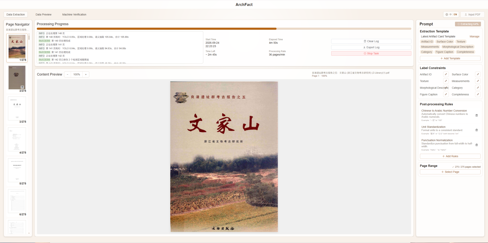
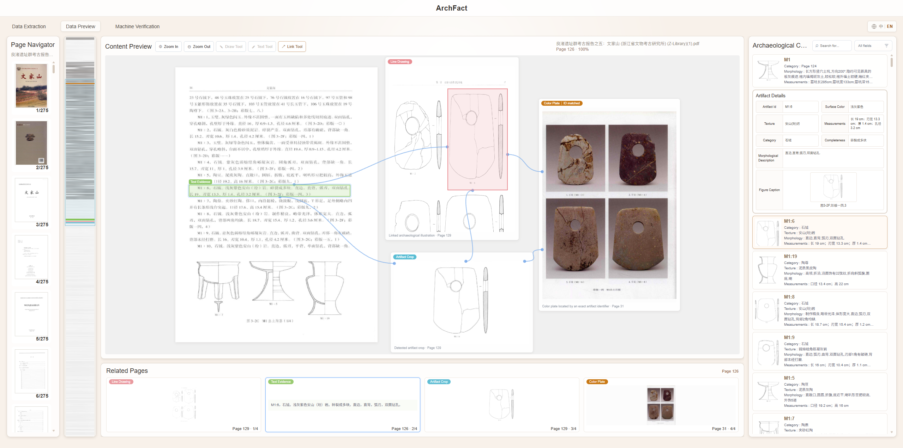
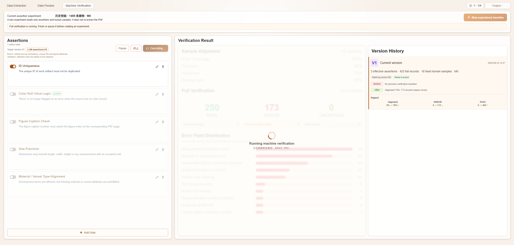
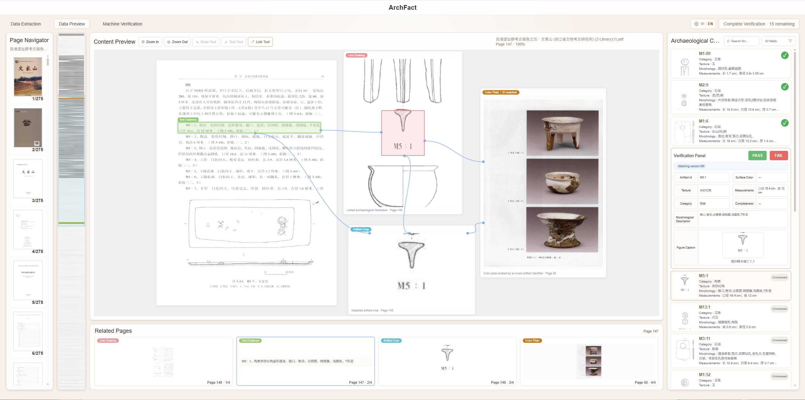
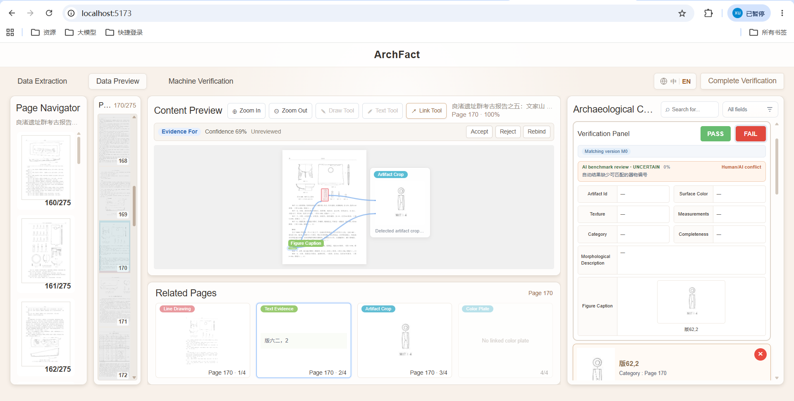
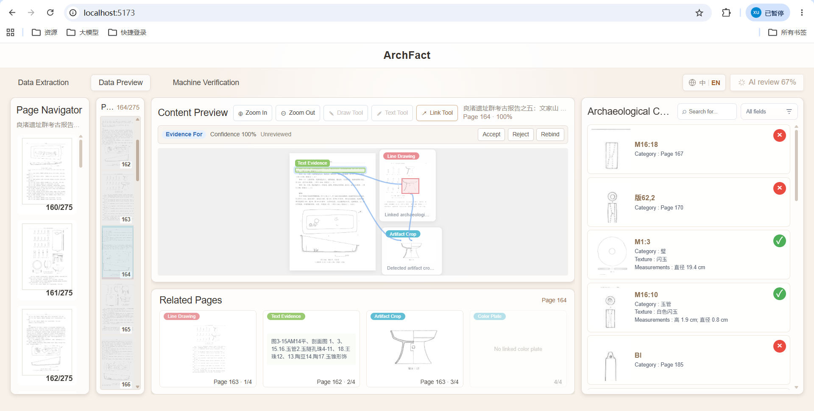

# ArchFact

**English** | [中文](./README中文.md)

ArchFact is a platform for extracting structured information from archaeology report PDFs and verifying results with human review. It uses a Vue 3 frontend and a FastAPI backend, stores business data and source PDFs in MongoDB/GridFS, and optionally integrates PaddleOCR, YOLO, and large language models.

**Important: the backend requires you to configure model APIs yourself.** The full extraction pipeline depends on a local `.env` file (copy from `ArchFactServer/.env.example`). Which services you enable—and which providers you use—should match your own environment, for example:

- **LLM API** (semantic field extraction and AI review): e.g. DeepSeek (`LLM_PROVIDER` / `LLM_API_KEY` / `LLM_MODEL`, etc.); you may also use other OpenAI-compatible endpoints
- **OCR**: e.g. PaddleOCR (`OCR_ADAPTER=paddle`, plus a separate conda env / `PADDLE_OCR_PYTHON`)
- **YOLO detection**: e.g. the archaeology model in this repo (`YOLO_ADAPTER=ultralytics`, with `models/archaeology-yolo/v1/best.pt`)

If a component is not configured, that capability stays disabled or degraded. Keep API keys and model weights on your machine only—do not commit them to a public repository. See [SETUP_WINDOWS.md](SETUP_WINDOWS.md) for setup details.

## Version baselines

- Current tag: [`quality-baseline-v2`](https://github.com/mdlvxu/ArchFact/releases/tag/quality-baseline-v2) (2026-08-12)
- Previous: `quality-baseline-v1` (2026-07-28)
- Release notes: [CHANGELOG.md](./CHANGELOG.md)
- App notes: `ArchFactClient/BASELINE.md`, `ArchFactServer/BASELINE.md`

## Project layout

```text
ArchFact/
├─ ArchFactClient/       # Vue 3 + TypeScript + Vite
├─ ArchFactServer/       # FastAPI + PyMongo + PyMuPDF
├─ start-archfact.cmd    # One-click start
├─ stop-archfact.cmd     # One-click stop
├─ status-archfact.cmd   # Health / status check
└─ SETUP_WINDOWS.md      # Windows setup guide
```

## Default ports

- Frontend: http://localhost:5173
- Backend: http://localhost:8080
- API docs: http://localhost:8080/docs
- MongoDB: mongodb://localhost:27017

## Quick start

Before the first run, follow [SETUP_WINDOWS.md](SETUP_WINDOWS.md) to install Node.js, pnpm, Python, and MongoDB, then create local `.env` files.  
At minimum, configure the backend LLM API for your environment; for the full dual-channel pipeline, also set up OCR and YOLO (see the note above).

After the environment is ready, double-click in the project root:

```text
start-archfact.cmd
```

The script starts MongoDB, the backend, and the frontend, waits for health checks, then opens the browser. Running it again will not start duplicate services.

You can also run these `.cmd` files from PowerShell in the project root:

```powershell
# Start and open the browser
.\start-archfact.cmd

# Check status
.\status-archfact.cmd

# Stop frontend, backend, and the bundled MongoDB
.\stop-archfact.cmd
```

To start without opening a browser:

```powershell
powershell.exe -NoProfile -ExecutionPolicy Bypass -File .\start-archfact.ps1 -NoBrowser
```

When stopping MongoDB, the script asks for a clean shutdown so data is flushed to disk. Logs are written under `ArchFactClient/.runtime-logs/` and `ArchFactServer/.runtime-logs/` and are not committed to Git.

## Local files and secrets

These items are not uploaded to GitHub and must be configured or backed up locally:

- API keys in `ArchFactServer/.env` (DeepSeek, Coze, etc.)
- MongoDB data and `ArchFactServer/.runtime/`
- PaddleOCR model cache and its separate Python environment
- YOLO weights at `ArchFactServer/models/archaeology-yolo/v1/best.pt`
- Manual annotations and reference materials
- Local secret configs such as `ArchFactClient/.cursor/mcp.json`

Do not commit real secrets, databases, uploaded files, or model weights to a public repository.

## Verification

```powershell
# Frontend
Set-Location ArchFactClient
pnpm type-check
pnpm lint:check
pnpm test:run
pnpm build

# Backend
Set-Location ..\ArchFactServer
.\.venv\Scripts\python.exe -m pytest
.\.venv\Scripts\python.exe -m ruff check .
```

## Operator workflow

Default entry: `http://localhost:5173/`  
Top tabs: **Data Extraction → Data Preview → Machine Verification**.

> Screenshots live in `ArchFactClient/docs/readme-images/`.  
> Source files on this machine: `C:\Users\dell\Pictures\Screenshots\ArchFact`

---

### 1. End-to-end flow


```text
Upload PDF
  → Configure page range / template and start extraction
  → PDF preprocessing (text layer / OCR)
  → Dual-channel extraction (OCR→LLM + image→YOLO)
  → Relation matching → fusion & storage
  → Data Preview: review artifacts, evidence, and links
  → Machine Verification: run assertions, review fixed 18 samples
  → AI review (DeepSeek)
  → Freeze a version (e.g. V1) and export
```

---

### 2. Start the project (short)

1. Start MongoDB (bundled `mongod` on port `27017` is fine).
2. Start the backend: in `ArchFactServer`, run `.\.venv\Scripts\python.exe run.py` (default `http://localhost:8080`).
3. Start the frontend: in `ArchFactClient`, run `pnpm dev` (default `http://localhost:5173`).
4. Open the frontend URL; use the top-right toggle for **中 / EN**.

---

### 3. Tab 1: Data Extraction

**Goal:** Upload an archaeology report PDF, configure the extraction scope, and start the backend pipeline (page rendering, OCR, YOLO detection, semantic extraction, relation matching, etc.).



#### Steps

1. Open the top **Data Extraction** tab.
2. Click **Input PDF** in the top-right and choose the report file.
3. In settings, confirm:
   - Page range (single pages, ranges, or combinations)
   - Extraction template / fields
   - Post-processing rules (if any)
4. Start extraction and watch progress / logs.
5. When the job finishes (or finishes with warnings), the UI usually switches to **Data Preview**.

---

### 4. Tab 2: Data Preview (browse & check)

**Goal:** Compare the PDF with the structured catalog; inspect text evidence, line drawings, YOLO crops, and color-plate links.



#### UI regions

| Region | Role |
| --- | --- |
| Left: Page Navigator | Switch report pages and thumbnails |
| Center top: Content Preview | Page annotations, evidence boxes, YOLO detections |
| Center bottom: Related Pages | Line drawings / text evidence / crops / color plates |
| Right: Archaeological Catalog | Artifact cards and detail fields |

#### Steps

1. Pick a page on the left and confirm the PDF preview loads.
2. Select an artifact in the catalog and review fields (ID, color, texture, measurements, category, morphology, etc.).
3. Click annotations in Content Preview to verify:
   - Text evidence matches the source
   - Line drawings / crops are correct
   - Relations are reasonable
4. To adjust a relation, use **Accept / Reject / Rebind** in the preview area.

---

### 5. Tab 3: Machine Verification (start review)

**Goal:** Configure assertion rules and run machine verification. The system samples a fixed set of **18** items for human review.



#### UI regions

| Region | Role |
| --- | --- |
| Left: Assertions | Enable / edit rules, click **Execute** |
| Center: Verification Result | Sample alignment, pass/error stats, error-field distribution |
| Right: Version History | Summaries and impact diffs for V1, V2, … |
| Top-right: Export | Download the exportable verification version JSON |

#### Steps

1. Open the top **Machine Verification** tab.
2. Confirm the rules to enable (ID uniqueness, color null logic, figure-caption checks, etc.).
3. Click **Execute**.
4. After the verification session is created, the UI enters **review mode** under Data Preview (fixed 18 samples).

---

### 6. Human review of 18 samples

**Goal:** Mark each fixed sample as human **Pass / Fail** before AI review and version freeze.



#### Tips

1. The top-right shows **Complete verification · N remaining**.
2. Browse PDF pages on the left, check evidence in the center, and act in the verification panel on the right.
3. For the current sample:
   - **Pass**: human accepts the extraction
   - **Fail**: choose a failure type (field error, text-evidence error, caption match error, etc.) and optionally add a note
4. Continue until all 18 samples are reviewed (remaining = 0).

#### Submit when finished

When all 18 samples have human verdicts, the top-right becomes clickable **Complete verification**:



This starts DeepSeek AI review (it does not rewrite production extraction records; it only compares human vs AI).

---

### 7. AI review in progress

**Goal:** The LLM compares automatic results, OCR evidence, and gold labels (if bound), then records agreement / conflict with human verdicts.



#### Tips

1. The top-right shows progress such as **AI review xx%**. Wait and keep the page open.
2. The catalog shows pass/fail markers on samples.
3. When AI finishes, the system freezes a version (e.g. **V1**) using the human PASS/FAIL verdicts and jumps to **Machine Verification**. Human–AI conflicts are kept in the version report and no longer block version creation.

---

### 8. Inspect the version and export

Back on **Machine Verification**:

1. Select V1 / V2 / … in **Version History**
2. Review sample alignment, pass/error counts, and error-field distribution
3. Click **Export** in the top-right to download a file such as `archfact-V1-M0.json`


