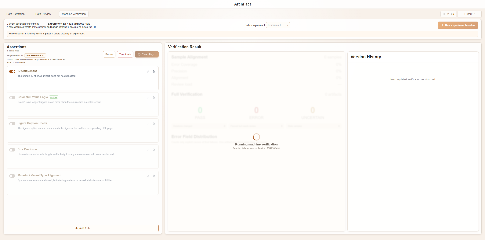
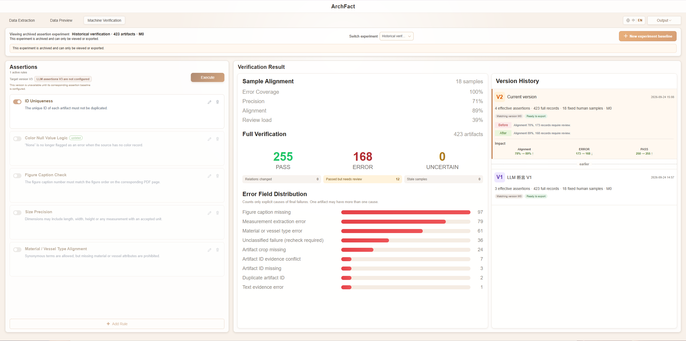

# ArchFact

**English** | [中文](./README中文.md)

ArchFact is a platform for extracting structured information from archaeology report PDFs and verifying results with human review. It uses a Vue 3 frontend and a FastAPI backend, stores business data and source PDFs in MongoDB/GridFS, and optionally integrates PaddleOCR, YOLO, and large language models.

**Important: the backend requires you to configure model APIs yourself.** The full extraction pipeline depends on a local `.env` file (copy from `ArchFactServer/.env.example`). Which services you enable—and which providers you use—should match your own environment, for example:

- **LLM API** (semantic field extraction and AI review): e.g. DeepSeek (`LLM_PROVIDER` / `LLM_API_KEY` / `LLM_MODEL`, etc.); you may also use other OpenAI-compatible endpoints
- **OCR**: e.g. PaddleOCR (`OCR_ADAPTER=paddle`, plus a separate conda env / `PADDLE_OCR_PYTHON`)
- **YOLO detection**: e.g. the archaeology model in this repo (`YOLO_ADAPTER=ultralytics`, with `models/archaeology-yolo/v1/best.pt`)

If a component is not configured, that capability stays disabled or degraded. Keep API keys and model weights on your machine only—do not commit them to a public repository. See [SETUP_WINDOWS.md](SETUP_WINDOWS.md) for setup details.

## Version baselines

- Current tag: `quality-baseline-v6` (2026-09-24)
- Previous: `quality-baseline-v5` (2026-09-20) · [`quality-baseline-v4`](https://github.com/mdlvxu/ArchFact/releases/tag/quality-baseline-v4) (2026-09-07) · [`quality-baseline-v3`](https://github.com/mdlvxu/ArchFact/releases/tag/quality-baseline-v3) (2026-08-13) · `quality-baseline-v2` (2026-08-12) · `quality-baseline-v1` (2026-07-28)
- Release notes: [CHANGELOG.md](./CHANGELOG.md) (English) · [CHANGELOG中文.md](./CHANGELOG中文.md) (中文)
- App notes: `ArchFactClient/BASELINE.md`, `ArchFactServer/BASELINE.md`

## Project layout

```text
ArchFact/
├─ ArchFactClient/       # Vue 3 + TypeScript + Vite
├─ ArchFactServer/       # FastAPI + PyMongo + PyMuPDF
├─ start-archfact.cmd    # One-click start
├─ stop-archfact.cmd     # One-click stop
├─ status-archfact.cmd   # Health / status check
├─ CHANGELOG.md          # Release notes (English)
├─ CHANGELOG中文.md      # Release notes (Chinese)
└─ SETUP_WINDOWS.md      # Windows setup guide
```

## Default ports

- Frontend: http://localhost:5173
- Backend: http://localhost:8080
- API docs: http://localhost:8080/docs
- MongoDB: mongodb://localhost:27017

## Quick start

Before the first run, follow [SETUP_WINDOWS.md](SETUP_WINDOWS.md) to install Node.js, pnpm, Python, and MongoDB, then create local `.env` files.  
At minimum, configure the backend LLM API for your environment; for the full dual-channel pipeline, also set up OCR and YOLO (see the note above).

After the environment is ready, double-click in the project root:

```text
start-archfact.cmd
```

The script starts MongoDB, the backend, and the frontend, waits for health checks, then opens the browser. Running it again will not start duplicate services.

You can also run these `.cmd` files from PowerShell in the project root:

```powershell
# Start and open the browser
.\start-archfact.cmd

# Check status
.\status-archfact.cmd

# Stop frontend, backend, and the bundled MongoDB
.\stop-archfact.cmd
```

To start without opening a browser:

```powershell
powershell.exe -NoProfile -ExecutionPolicy Bypass -File .\start-archfact.ps1 -NoBrowser
```

When stopping MongoDB, the script asks for a clean shutdown so data is flushed to disk. Logs are written under `ArchFactClient/.runtime-logs/` and `ArchFactServer/.runtime-logs/` and are not committed to Git.

## Local files and secrets

These items are not uploaded to GitHub and must be configured or backed up locally:

- API keys in `ArchFactServer/.env` (DeepSeek, Coze, etc.)
- MongoDB data and `ArchFactServer/.runtime/`
- PaddleOCR model cache and its separate Python environment
- YOLO weights at `ArchFactServer/models/archaeology-yolo/v1/best.pt`
- Manual annotations and reference materials
- Local secret configs such as `ArchFactClient/.cursor/mcp.json`

Do not commit real secrets, databases, uploaded files, or model weights to a public repository.

## Verification

```powershell
# Frontend
Set-Location ArchFactClient
pnpm type-check
pnpm lint:check
pnpm test:run
pnpm build

# Backend
Set-Location ..\ArchFactServer
.\.venv\Scripts\python.exe -m pytest
.\.venv\Scripts\python.exe -m ruff check .
```

## Operator workflow

Open the app at `http://localhost:5173/`. The top-level workflow is **Data Extraction → Data Preview → Machine Verification**. Use the **中 / EN** switch in the upper-right corner at any time.

All screenshots in this guide are stored in `ArchFactClient/docs/readme-images/` and correspond to the source images in the repository-root `图片流程/` folder.

### 1. Workflow overview

```text
Import PDF → configure template, field prompts, and page range → start extraction
  → PDF text layer / PaddleOCR, YOLO artifact detection, LLM structured extraction
  → match and fuse artifact IDs, captions, line drawings, crops, and color plates
  → inspect cards, source evidence, and links in Data Preview
  → V1: LLM Assertions V1 + selected rules over the full card set → 18 fixed human samples
  → AI calculates sample consistency from the human decisions and freezes V1
  → V2: LLM Assertions V2 + selected rules over the full card set, reusing the same 18 samples
  → inspect versions, compare metrics, and export JSON or Excel details
```

Machine verification counts only **deduplicated entity cards with a linked artifact crop**. Text-only provenance records, records without a crop, and repeated page-level records are retained in the project but are excluded from the full verification total and the 18-sample cohort.

### 2. Start the project

After completing [SETUP_WINDOWS.md](SETUP_WINDOWS.md), double-click `start-archfact.cmd` in the project root. It starts MongoDB, the backend, and the frontend, then opens the browser.

You may also run the following in PowerShell:

```powershell
.\start-archfact.cmd    # start
.\status-archfact.cmd   # inspect status
.\stop-archfact.cmd     # stop cleanly
```

Before a full first extraction, configure the LLM, PaddleOCR, and YOLO as needed in local `.env` files. Unconfigured capabilities are unavailable or run in a degraded mode.

### 3. Data Extraction: import, configure, and run


1. Open **Data Extraction** and click **Input PDF**.
2. Choose an **Extraction Template** on the right. The Latest Artifact Card Template is intended for everyday use; Basic Research Template retains the full archaeological-card field composition.
3. To revise one field's extraction rule, click the pencil beside that field in **Label Constraints**, edit its prompt directly, and save.
4. Preview the combined field prompt in the template area. The system public prompt can also be previewed and edited separately. Changes apply to subsequently started extractions; they do not rewrite existing cards.
5. Enable any required **Post-processing Rules**, such as Chinese-number conversion, unit standardization, or punctuation normalization.
6. Select single pages, ranges, or a combination in **Page Range**, then start extraction.

Progress shows elapsed time, estimated time remaining, page rate, and logs. You can stop a task; completed pages and persisted artifact cards remain available. When the task finishes, continue in **Data Preview**.

### 4. Data Preview: inspect cards and relations


| Region | Purpose |
| --- | --- |
| Page Navigator | Select PDF pages and thumbnails. |
| Content Preview | Inspect the source page, text-evidence boxes, line drawings, YOLO crops, and links. |
| Related Pages | Compare linked line drawings, text evidence, artifact crops, and color plates side by side. |
| Archaeological Catalog | Browse eligible artifact cards and their detail fields. |

Select a card in the catalog, then check its ID, dimensions, texture/surface color, category, morphology, and figure caption. Click linked content in the preview to verify that the evidence comes from the right source text and that the line drawing, crop, and color plate refer to the same artifact.

Only entities with a valid artifact crop appear as eligible cards. Text-only records without a crop do not create catalog cards and never enter machine verification.

### 5. Machine Verification: V1 baseline and full assertions



1. Open **Machine Verification** and confirm the active assertion experiment, eligible artifact count, and matching-version ID.
2. The first run always uses **LLM Assertions V1**. Enable or edit the additional verification rules required for this run.
3. Click **Execute**. The system applies the V1 baseline and selected rules to every eligible artifact card.
4. While running, use **Pause**, **Resume**, or **Terminate** as needed. Terminating discards the incomplete run so you can change rules and start again; it does not require PDF re-extraction.
5. When the V1 full run completes, the system fixes a balanced cohort of 18 records and opens human-review mode in Data Preview.

A **New experiment baseline** does not re-extract the PDF or delete fused cards. It opens an independent assertion sequence with a new V1 and a new fixed 18-sample cohort. The current experiment must complete its V1 full run, human review, and AI review before another baseline can be created. Archived experiments are view/export only.

### 6. Human review of the fixed 18 samples


1. The upper-right status reads **Complete Verification · N remaining**.
2. For each sample, inspect the fields, source evidence, line drawing, crop, and color-plate relations in the right-hand verification panel.
3. Choose **PASS** if the card is acceptable. Choose **FAIL** to select a failure type and optionally add a note.
4. After submitting a decision, the panel collapses so you can select the next item. When all 18 records are reviewed, click **Complete Verification**.

Human decisions are the reference for version evaluation. They do not directly overwrite production cards or the original extraction output.

### 7. AI review, V1 freeze, and V2

After human review, the system compares the fixed samples' human decisions with the V1 machine decisions and calculates a confusion matrix and four metrics: Error Coverage, Precision, Alignment, and Review Load. Human PASS/FAIL remains the evaluation reference.

After V1 is frozen, return to Machine Verification for the result. The second run automatically targets **LLM Assertions V2**: select rules, run full verification again, and reuse the same 18 samples for comparable metrics. V3 is not executable until its corresponding assertion baseline is configured.



The result page provides:

- **Sample Alignment**: the four metrics calculated from the 18 reviewed samples;
- **Full Verification**: the actual deduplicated eligible-card total and PASS, ERROR, and UNCERTAIN counts;
- **Error Field Distribution**: only explicit causes of final failures; one card may have more than one cause;
- **Version History**: assertion baseline, rules, impact, and export status for V1, V2, and later versions.

### 8. Export and notes

The upper-right **Output** menu provides two files:

| File | Contents |
| --- | --- |
| Experiment snapshot JSON | Current experiment metadata, assertion baseline, rules, samples, metrics, and version data; suitable for archival or programmatic use. |
| Full machine-verification details Excel | Per-card machine verdicts, reasons, field-level decisions, relation information, and summaries; suitable for manual review and delivery. |

If a legacy page shows a different artifact count from an older screenshot, use the actual **Full Verification** count. It excludes text-only records without crops and deduplicates entities. Refresh Machine Verification to update an existing experiment's displayed count; PDF re-extraction is not required.
