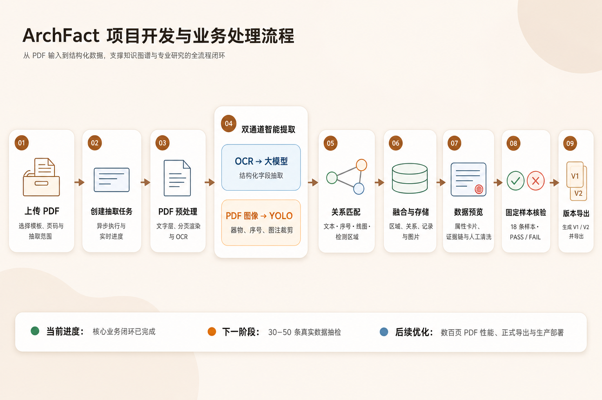
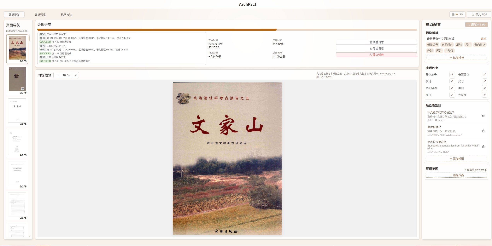
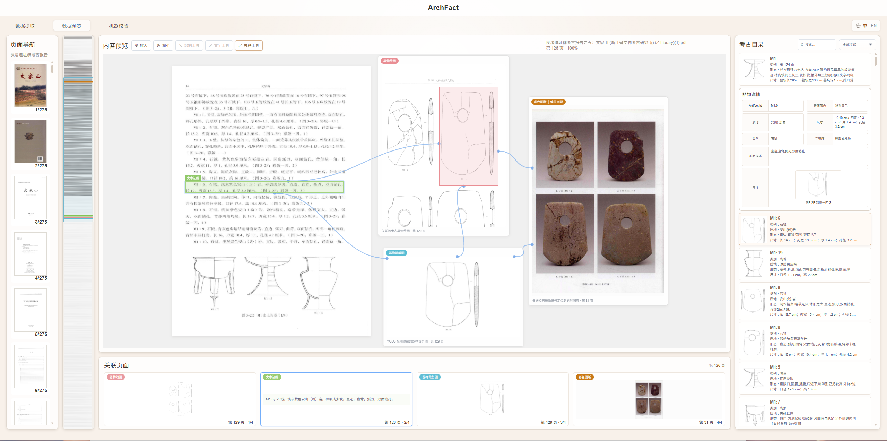
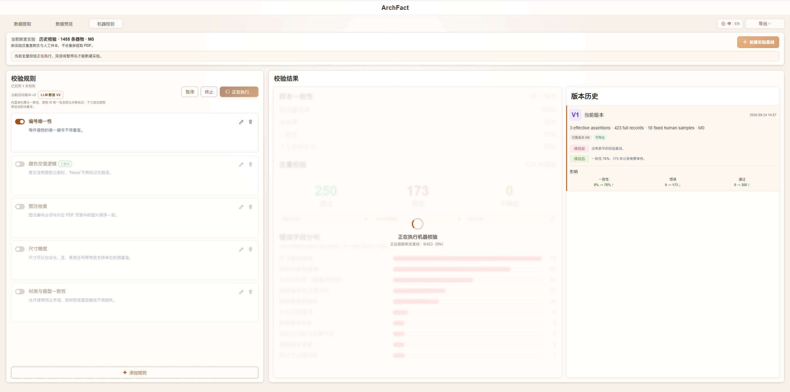
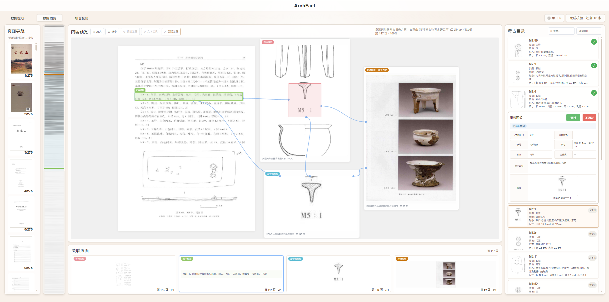
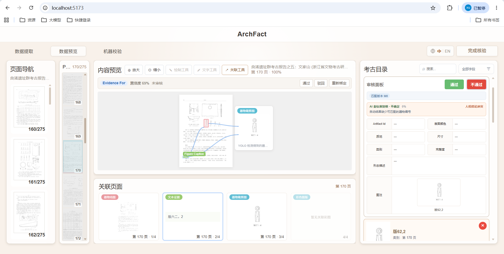
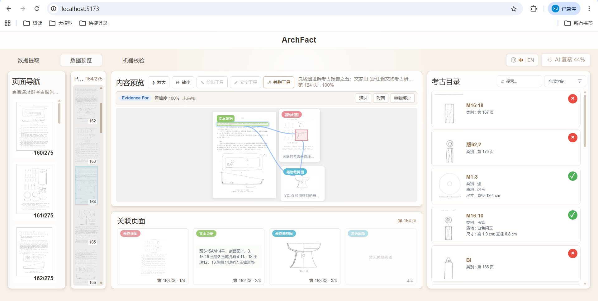

# ArchFact

[English](./README.md) | **中文**

ArchFact 是一个面向考古报告 PDF 的信息提取与人工核验平台。项目由 Vue 3 前端和 FastAPI 后端组成，使用 MongoDB/GridFS 保存业务数据和原始 PDF，并可选接入 PaddleOCR、YOLO 与大语言模型。

**重要：后端需要自行配置模型与 API。** 完整抽取链路依赖本地 `.env`（可从 `ArchFactServer/.env.example` 复制）。具体启用哪些能力、对接哪个服务，请按实际环境选择，例如：

- **大模型 API**（语义字段抽取、AI 复核）：如 DeepSeek（`LLM_PROVIDER` / `LLM_API_KEY` / `LLM_MODEL` 等）；也可换成兼容 OpenAI 协议的其他服务
- **OCR**：如 PaddleOCR（`OCR_ADAPTER=paddle`，并配置独立 conda/`PADDLE_OCR_PYTHON`）
- **YOLO 检测**：如本仓库考古模型（`YOLO_ADAPTER=ultralytics`，并准备 `models/archaeology-yolo/v1/best.pt`）

未配置对应项时，相关能力会处于关闭或降级状态；密钥与权重请只放在本机，勿提交到公开仓库。详细步骤见 [SETUP_WINDOWS.md](SETUP_WINDOWS.md)。

## 版本基线

- 当前推荐标签：[`quality-baseline-v3`](https://github.com/mdlvxu/ArchFact/releases/tag/quality-baseline-v3)（2026-08-13）
- 上一基线：`quality-baseline-v2`（2026-08-12）· `quality-baseline-v1`（2026-07-28）
- 变更说明：[CHANGELOG中文.md](./CHANGELOG中文.md)（中文）· [CHANGELOG.md](./CHANGELOG.md)（English）
- 前后端子项目说明：`ArchFactClient/BASELINE.md`、`ArchFactServer/BASELINE.md`

## 项目结构

```text
ArchFact/
├─ ArchFactClient/       # Vue 3 + TypeScript + Vite
├─ ArchFactServer/       # FastAPI + PyMongo + PyMuPDF
├─ start-archfact.cmd    # 双击一键启动
├─ stop-archfact.cmd     # 双击一键停止
├─ status-archfact.cmd   # 双击检查运行状态
└─ SETUP_WINDOWS.md      # Windows 安装与配置指南
```

## 默认端口

- 前端：http://localhost:5173
- 后端：http://localhost:8080
- API 文档：http://localhost:8080/docs
- MongoDB：mongodb://localhost:27017

## 快速开始

首次使用前，请按照 [SETUP_WINDOWS.md](SETUP_WINDOWS.md) 安装 Node.js、pnpm、Python 和 MongoDB，并创建本地 `.env`。  
至少应确认后端已按需配置大模型 API；若要跑完整双通道抽取，还需配置 OCR 与 YOLO（见上方简介）。

完成一次环境配置后，在项目根目录双击：

```text
start-archfact.cmd
```

脚本会依次启动 MongoDB、后端和前端，等待健康检查通过后打开浏览器。重复执行不会重复启动服务。

也可以在项目根目录的 PowerShell 中执行这些 `.cmd` 文件：

```powershell
# 启动并自动打开浏览器
.\start-archfact.cmd

# 查看状态
.\status-archfact.cmd

# 正常停止前端、后端和项目内置 MongoDB
.\stop-archfact.cmd
```

如需启动但不打开浏览器，可执行：

```powershell
powershell.exe -NoProfile -ExecutionPolicy Bypass -File .\start-archfact.ps1 -NoBrowser
```

停止 MongoDB 时脚本会先请求正常关闭，确保数据落盘。日志分别保存在
`ArchFactClient/.runtime-logs/` 和 `ArchFactServer/.runtime-logs/`，这些运行文件不会提交到 Git。

## 本地文件与敏感配置

以下内容不会上传到 GitHub，需要开发者自行配置或备份：

- `ArchFactServer/.env` 中的 DeepSeek、Coze 等 API 密钥
- MongoDB 数据及 `ArchFactServer/.runtime/`
- PaddleOCR 模型缓存和独立 Python 环境
- YOLO 权重 `ArchFactServer/models/archaeology-yolo/v1/best.pt`
- 人工标注与参考资料
- `ArchFactClient/.cursor/mcp.json` 等本机密钥配置

不要将真实密钥、数据库、上传文件或模型权重提交到公开仓库。

## 验证

```powershell
# 前端
Set-Location ArchFactClient
pnpm type-check
pnpm lint:check
pnpm test:run
pnpm build

# 后端
Set-Location ..\ArchFactServer
.\.venv\Scripts\python.exe -m pytest
.\.venv\Scripts\python.exe -m ruff check .
```

## 操作流程说明

系统默认入口：`http://localhost:5173/`  
顶部三个主页面：**数据提取 → 数据预览 → 机器校验**。

> 截图保存在仓库 `ArchFactClient/docs/readme-images/`，对应本机素材目录：  
> `C:\Users\dell\Pictures\Screenshots\ArchFact`

---

### 一、整体流程概览



```text
上传 PDF
  → 配置抽取页码 / 模板并开始抽取
  → PDF 预处理（文字层 / OCR）
  → 双通道智能提取（OCR→大模型 + 图像→YOLO）
  → 关系匹配 → 融合与存储
  → 数据预览：核对器物、证据与关联
  → 机器校验：执行校验，进入固定 18 条人工核验
  → AI（DeepSeek）复核
  → 生成版本（如 V1）并导出
```

---

### 二、启动项目（简要）

1. 启动 MongoDB（本机可用项目内置 `mongod`，端口 `27017`）。
2. 启动后端：进入 `ArchFactServer`，执行 `.\.venv\Scripts\python.exe run.py`（默认 `http://localhost:8080`）。
3. 启动前端：进入 `ArchFactClient`，执行 `pnpm dev`（默认 `http://localhost:5173`）。
4. 浏览器打开前端地址；右上角可切换 **中 / EN**。

---

### 三、页面一：数据提取

**目的：** 上传考古报告 PDF，配置抽取范围，启动后端流水线（分页渲染、OCR、YOLO 检测、语义抽取、关系匹配等）。



#### 操作步骤

1. 打开顶部 **数据提取**。
2. 点击右上角 **输入 PDF**，选择报告文件。
3. 在设置区确认：
   - 抽取页码范围（可单页、区间或组合）
   - 抽取模板 / 字段
   - 后处理规则（如有）
4. 点击开始抽取，观察进度与日志。
5. 任务状态变为完成（或带警告完成）后，系统通常会切到 **数据预览**。

---

### 四、页面二：数据预览（浏览核对）

**目的：** 在 PDF 与结构化目录之间对照查看抽取结果，检查文本证据、器物线图、YOLO 裁剪图、彩版关联等。



#### 界面区域

| 区域 | 作用 |
| --- | --- |
| 左侧「页面导航」 | 切换报告页码与缩略图 |
| 中上「内容预览」 | 查看当前页标注、证据框与 YOLO 检测结果 |
| 中下「关联页面」 | 查看线图 / 文本证据 / 裁剪图 / 彩版等关联卡片 |
| 右侧「考古目录」 | 浏览器物卡片，打开「器物详情」核对字段 |

#### 操作步骤

1. 在左侧选择页码，确认 PDF 预览加载正常。
2. 在右侧目录中点选器物，查看详情字段（编号、颜色、质地、尺寸、类别、形态描述等）。
3. 在内容预览中点击标注，核对：
   - 文本证据是否对应原文
   - 器物线图 / 裁剪图是否正确
   - 关联关系是否合理
4. 如需调整关系，可使用预览区的 **通过 / 驳回 / 重新绑定**（针对当前证据关系）。

---

### 五、页面三：机器校验（发起核验）

**目的：** 配置断言规则，对当前抽取任务发起机器校验；系统会抽取固定 **18 条**样本进入人工核验。



#### 界面区域

| 区域 | 作用 |
| --- | --- |
| 左侧「校验规则」 | 启用 / 编辑规则，点击「执行校验」 |
| 中部「校验结果」 | 查看样本一致性、通过/错误统计、错误字段分布 |
| 右侧「版本历史」 | 查看 V1、V2… 各版本摘要与影响对比 |
| 右上角「导出」 | 导出当前可导出的校验版本 JSON |

#### 操作步骤

1. 打开顶部 **机器校验**。
2. 在左侧确认需要启用的规则（如编号唯一性、颜色空值逻辑、图注检查等）。
3. 点击 **执行校验**。
4. 系统创建校验会话后，自动进入「数据预览」下的 **审核模式**（固定 18 条样本）。

---

### 六、人工核验 18 条样本

**目的：** 对固定样本逐条给出人工 **通过 / 不通过**，为后续 AI 复核与版本冻结提供人工审核结论。



#### 操作要点

1. 右上角显示 **完成核验 · 还剩 N 条**，表示尚未审完的条数。
2. 左侧仍可按页浏览 PDF；中间核对证据与关联；右侧在审核面板操作。
3. 对当前样本：
   - 点 **通过**：表示人工认为抽取结果正确
   - 点 **不通过**：选择失败类型（字段错误、文本证据错误、图注匹配错误等），可填备注后确认
4. 逐条审完 18 条，直到剩余为 0。

#### 审完后可提交

当 18 条均已人工结论时，右上角变为可点击的 **完成核验**：



点击后将启动 DeepSeek AI 复核（不会改写生产抽取记录，只做人机对照）。

---

### 七、AI 复核进行中

**目的：** 大模型对照自动结果、OCR 证据与人工标注数据（若已绑定），给出 AI 结论并与人工结论比对。



#### 操作要点

1. 右上角显示类似 **AI 复核 xx%**，期间请等待，不要关闭页面。
2. 右侧目录可看到样本通过/不通过标记。
3. 复核结束后，系统以人工 PASS/FAIL 为准冻结版本（如 **V1**），并跳转到 **机器校验** 页；人机冲突会记录在版本报告中，不再阻塞出版本。

---

### 八、查看版本结果并导出

回到 **机器校验** 页后：

1. 在右侧 **版本历史** 中选择 V1 / V2…
2. 中部查看该版本的样本一致性、通过/错误数量、错误字段分布
3. 需要对外交付时，点击右上角 **导出**，下载如 `archfact-V1-M0.json` 的结果文件


