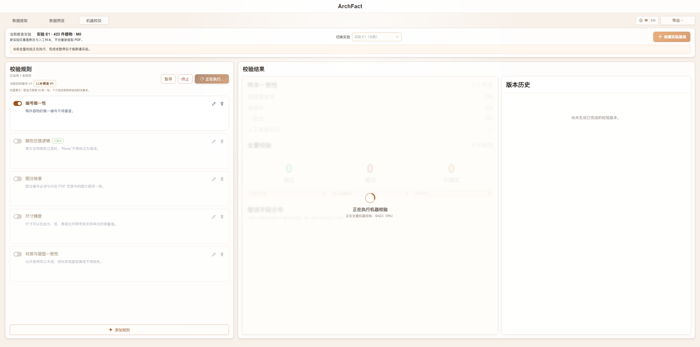
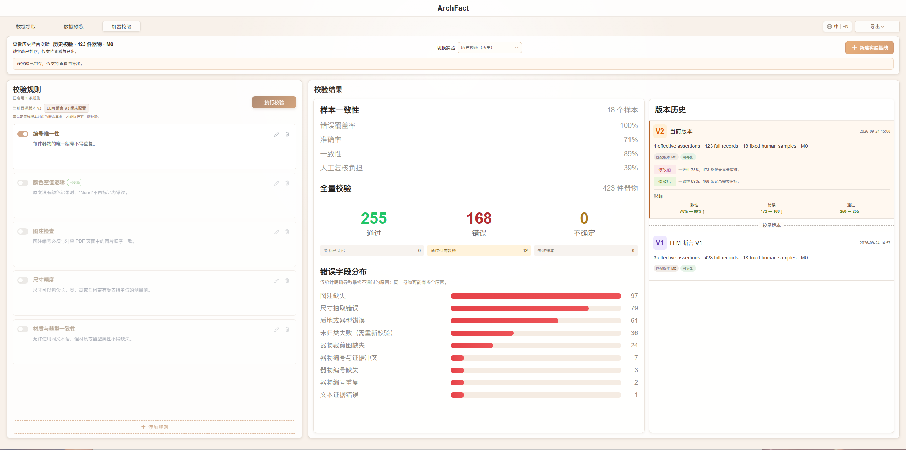

# ArchFact

[English](./README.md) | **中文**

ArchFact 是一个面向考古报告 PDF 的信息提取与人工核验平台。项目由 Vue 3 前端和 FastAPI 后端组成，使用 MongoDB/GridFS 保存业务数据和原始 PDF，并可选接入 PaddleOCR、YOLO 与大语言模型。

**重要：后端需要自行配置模型与 API。** 完整抽取链路依赖本地 `.env`（可从 `ArchFactServer/.env.example` 复制）。具体启用哪些能力、对接哪个服务，请按实际环境选择，例如：

- **大模型 API**（语义字段抽取、AI 复核）：如 DeepSeek（`LLM_PROVIDER` / `LLM_API_KEY` / `LLM_MODEL` 等）；也可换成兼容 OpenAI 协议的其他服务
- **OCR**：如 PaddleOCR（`OCR_ADAPTER=paddle`，并配置独立 conda/`PADDLE_OCR_PYTHON`）
- **YOLO 检测**：如本仓库考古模型（`YOLO_ADAPTER=ultralytics`，并准备 `models/archaeology-yolo/v1/best.pt`）

未配置对应项时，相关能力会处于关闭或降级状态；密钥与权重请只放在本机，勿提交到公开仓库。详细步骤见 [SETUP_WINDOWS.md](SETUP_WINDOWS.md)。

## 版本基线

- 当前推荐标签：`quality-baseline-v6`（2026-09-24）
- 上一基线：`quality-baseline-v5`（2026-09-20）· [`quality-baseline-v4`](https://github.com/mdlvxu/ArchFact/releases/tag/quality-baseline-v4)（2026-09-07）· [`quality-baseline-v3`](https://github.com/mdlvxu/ArchFact/releases/tag/quality-baseline-v3)（2026-08-13）· `quality-baseline-v2`（2026-08-12）· `quality-baseline-v1`（2026-07-28）
- 变更说明：[CHANGELOG中文.md](./CHANGELOG中文.md)（中文）· [CHANGELOG.md](./CHANGELOG.md)（English）
- 前后端子项目说明：`ArchFactClient/BASELINE.md`、`ArchFactServer/BASELINE.md`

## 项目结构

```text
ArchFact/
├─ ArchFactClient/       # Vue 3 + TypeScript + Vite
├─ ArchFactServer/       # FastAPI + PyMongo + PyMuPDF
├─ start-archfact.cmd    # 双击一键启动
├─ stop-archfact.cmd     # 双击一键停止
├─ status-archfact.cmd   # 双击检查运行状态
├─ CHANGELOG.md          # 变更说明（English）
├─ CHANGELOG中文.md      # 变更说明（中文）
└─ SETUP_WINDOWS.md      # Windows 安装与配置指南
```

## 默认端口

- 前端：http://localhost:5173
- 后端：http://localhost:8080
- API 文档：http://localhost:8080/docs
- MongoDB：mongodb://localhost:27017

## 快速开始

首次使用前，请按照 [SETUP_WINDOWS.md](SETUP_WINDOWS.md) 安装 Node.js、pnpm、Python 和 MongoDB，并创建本地 `.env`。  
至少应确认后端已按需配置大模型 API；若要跑完整双通道抽取，还需配置 OCR 与 YOLO（见上方简介）。

完成一次环境配置后，在项目根目录双击：

```text
start-archfact.cmd
```

脚本会依次启动 MongoDB、后端和前端，等待健康检查通过后打开浏览器。重复执行不会重复启动服务。

也可以在项目根目录的 PowerShell 中执行这些 `.cmd` 文件：

```powershell
# 启动并自动打开浏览器
.\start-archfact.cmd

# 查看状态
.\status-archfact.cmd

# 正常停止前端、后端和项目内置 MongoDB
.\stop-archfact.cmd
```

如需启动但不打开浏览器，可执行：

```powershell
powershell.exe -NoProfile -ExecutionPolicy Bypass -File .\start-archfact.ps1 -NoBrowser
```

停止 MongoDB 时脚本会先请求正常关闭，确保数据落盘。日志分别保存在
`ArchFactClient/.runtime-logs/` 和 `ArchFactServer/.runtime-logs/`，这些运行文件不会提交到 Git。

## 本地文件与敏感配置

以下内容不会上传到 GitHub，需要开发者自行配置或备份：

- `ArchFactServer/.env` 中的 DeepSeek、Coze 等 API 密钥
- MongoDB 数据及 `ArchFactServer/.runtime/`
- PaddleOCR 模型缓存和独立 Python 环境
- YOLO 权重 `ArchFactServer/models/archaeology-yolo/v1/best.pt`
- 人工标注与参考资料
- `ArchFactClient/.cursor/mcp.json` 等本机密钥配置

不要将真实密钥、数据库、上传文件或模型权重提交到公开仓库。

## 验证

```powershell
# 前端
Set-Location ArchFactClient
pnpm type-check
pnpm lint:check
pnpm test:run
pnpm build

# 后端
Set-Location ..\ArchFactServer
.\.venv\Scripts\python.exe -m pytest
.\.venv\Scripts\python.exe -m ruff check .
```

## 操作流程说明

系统入口：`http://localhost:5173/`。顶部工作流为 **数据提取 → 数据预览 → 机器校验**；右上角可随时切换 **中 / EN**。

本文使用的截图位于 `ArchFactClient/docs/readme-images/`，与项目根目录的 `图片流程/` 素材一一对应。

### 1. 工作流总览

```text
导入 PDF → 配置模板、字段提示词与页码范围 → 开始抽取
  → PDF 文字层 / PaddleOCR、YOLO 器物检测、LLM 结构化提取
  → 器物编号、图注、线图、裁剪图、彩图关系匹配与融合
  → 数据预览核对卡片、原文证据和关联关系
  → V1：LLM 断言 V1 + 所选规则全量校验 → 固定 18 条人工审核
  → AI 根据人工结果计算样本一致性并冻结 V1
  → V2：LLM 断言 V2 + 所选规则全量校验，复用同一批 18 条样本
  → 查看版本、比较指标、导出 JSON 或 Excel 明细
```

机器校验只统计**已关联器物裁剪图且按器物实体去重**的卡片。纯文本证据、无裁剪图记录和同一器物的重复页面记录会保留在数据中，但不会计入全量校验或 18 条样本。

### 2. 启动项目

完成 [SETUP_WINDOWS.md](SETUP_WINDOWS.md) 的环境配置后，在项目根目录双击 `start-archfact.cmd`。脚本会启动 MongoDB、后端和前端并打开浏览器。

也可在 PowerShell 中执行：

```powershell
.\start-archfact.cmd    # 启动
.\status-archfact.cmd   # 查看状态
.\stop-archfact.cmd     # 正常停止
```

首次完整抽取前，请确认本机 `.env` 已按需配置大模型、PaddleOCR 与 YOLO。未配置的能力会降级或不可用。

### 3. 数据提取：导入、配置与执行


1. 打开 **数据提取**，点击右上角 **导入 PDF**。
2. 在右侧 **提取模板** 选择模板。日常推荐使用“最新器物卡片提取模板”；基础研究模板保留考古卡片的完整字段组合。
3. 如需调整某一字段的抽取口径，在 **字段约束** 中点击字段右侧的铅笔，直接编辑该字段提示词并保存。
4. 在模板区域可预览字段组合后的提示词；系统公共提示词也可单独预览和编辑。修改会用于之后新启动的抽取任务，不会改写已经生成的卡片。
5. 在 **后处理规则** 中按需启用中文数字转换、单位标准化、标点规范化等规则。
6. 在 **页码范围** 选择单页、连续区间或组合范围，确认后开始抽取。

抽取过程会显示已用时间、预计剩余、页处理速度和日志。可停止任务；已完成的页面及已保存的器物卡片会被保留。任务完成后进入 **数据预览**。

### 4. 数据预览：核对卡片与关系


| 区域 | 用途 |
| --- | --- |
| 左侧页面导航 | 选择 PDF 页和缩略图。 |
| 中部内容预览 | 查看原始页面、文本证据框、线图、YOLO 裁剪图和连线。 |
| 底部关联页面 | 并列查看关联的线图、文本证据、器物裁剪图与彩图。 |
| 右侧考古目录 | 浏览可用器物卡片，查看器物详情字段。 |

操作时，先在目录选择一张器物卡片，再核对其器物编号、尺寸、质地/颜色、类别、形态描述和图注。点击页面中的关联内容可检查文本证据是否来自正确原文，以及线图、裁剪图、彩图是否属于同一器物。

只有存在有效器物裁剪图的实体才会显示为可校验器物卡片；仅含文字、没有裁剪图的记录不会生成目录卡片，也不会进入机器校验。

### 5. 机器校验：V1 基线与全量断言



1. 打开 **机器校验**。确认当前断言实验、可校验器物数与关联版本号。
2. 第一次校验固定使用 **LLM 断言 V1**；在左侧启用或编辑本次要追加的校验规则。
3. 点击 **执行校验**。系统将 V1 基线与所选规则一起应用于全部可校验器物。
4. 执行中可选择 **暂停**、**继续**或**终止**。终止会丢弃本次未完成的校验结果，便于修改规则后重新开始；无需重新提取 PDF。
5. V1 全量校验完成后，系统从本次结果中固定抽取 18 条样本，并自动进入数据预览的人工审核模式。

新建实验基线不会重提 PDF，也不会删除已融合的器物卡片；它只开启一套新的断言版本和新的 18 条固定样本。当前实验必须先完成 V1 的全量校验、人工审核和 AI 复核，才可以新建下一实验。历史实验只可查看和导出。

### 6. 人工审核固定 18 条样本


1. 右上角显示 **完成核验 · 还剩 N 条**。
2. 逐条检查右侧审核面板中当前器物的字段、原文证据、线图、裁剪图和彩图关系。
3. 选择 **通过**，表示人工认可这张卡片；选择 **不通过** 时，选择失败类型并可补充说明。
4. 提交结果后，审核面板会收起，可继续选择下一条器物。完成全部 18 条后，点击 **完成核验**。

人工结论是版本评测的参考基准，不会直接改写生产卡片或原始抽取结果。

### 7. AI 复核、V1 冻结与 V2

完成核验后，系统使用固定样本的人工结论与 V1 的机器结论计算混淆矩阵和四项指标：错误覆盖率、断言精确率、人机一致性、人工复核负担。人工 PASS/FAIL 始终为评测基准。

V1 冻结后，可在机器校验页查看结果。第二次校验时，系统自动切换为 **LLM 断言 V2**：重新选择规则并执行全量校验，继续复用同一批 18 条样本进行可比的指标计算。未配置的 V3 基线不会开放执行。



结果页包括：

- **样本一致性**：基于 18 条人工审核记录计算四项指标；
- **全量校验**：本版本实际参与校验的去重器物卡片数，以及通过、错误和不确定数量；
- **错误字段分布**：仅统计明确导致最终不通过的原因；同一器物可有多个原因；
- **版本历史**：查看 V1、V2 的断言基线、规则、影响变化和可导出状态。

### 8. 导出与常见说明

右上角 **导出** 菜单提供两种文件：

| 文件 | 内容 |
| --- | --- |
| 实验快照 JSON | 当前版本的实验信息、断言基线、规则、样本、指标与版本数据，适合归档或程序处理。 |
| 全量机器校验明细 Excel | 当前版本每张器物卡片的机器结论、原因、字段级结果、关联信息和汇总，适合人工复查与交付。 |

若页面中的器物数量与旧截图不同，以“全量校验”实际数量为准。该数量会排除无裁剪图文本记录，并对同一实体去重；重新刷新机器校验页即可更新旧实验的展示统计，无需重新提取 PDF。
